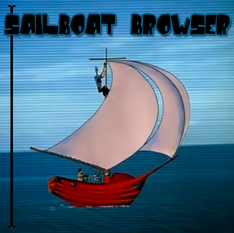
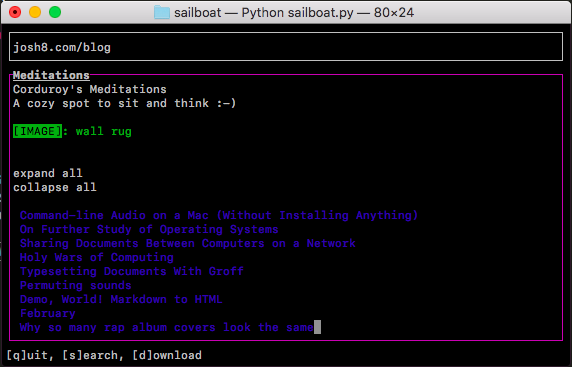

# sailboat
A command-line web browser!




## Usage
```python3
python3 sailboat.py [url]
```

## Dependencies
`python3`, `ncurses`, and `BeautifulSoup4`

One way to install BeautifulSoup4 is: `pip3 install beautifulsoup4`.

## WIP

This project is still a work in progress.

Some features that still need to be implemented are:
- bug-less scrolling up/down rendered content
- scrolling through and navigating links
- wrapping long image and link tags to multiple lines
- proper block vs. inline-block rendering of images/links
- special treatment of various elements
  + e.g. emphasized text like headings, bolded text, and italicized text should be displayed with emphasis
  + blockquotes, audio/video, lists etc
- google mode
- button to switch from displaying `alt`s to displaying `src`s
